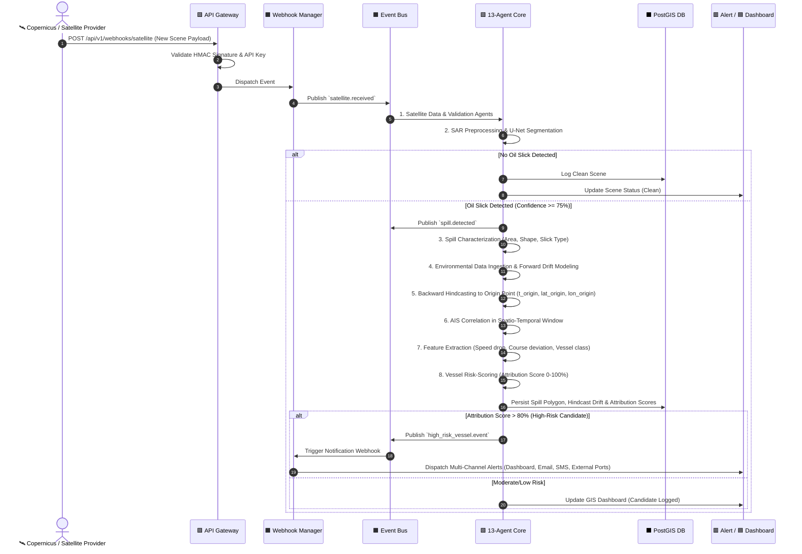

# OceanGuard: Multi-Agent AI Oil Spill Detection & Vessel Attribution Platform
## Production System Architecture with API Gateway & Webhook/Event Layer

---

### 1. Architectural Highlights
- **Layered Decoupling**: External data sources never directly access internal AI agents. All ingress traffic traverses the **API Gateway**.
- **Event-Driven Asynchronous Pipeline**: Inter-agent communication is governed by an **Event/Message Queue** and **Agent Orchestrator**, preventing synchronous blocking.
- **13-Agent AI Core**: The full 13-agent analytical sequence is preserved and orchestrated with granular pub/sub event topics.
- **Automated Real-Time Pipeline**: Ingested satellite scenes automatically cascade through detection, characterization, drift/hindcast modeling, AIS correlation, risk scoring, and multi-channel alerting without human intervention.
- **Strict Compliance & Legal Terminology**: Candidate polluters are categorized as *"Potential vessel"*, *"Suspected vessel"*, *"High-risk candidate"*, and evaluated using an *"Attribution Score"* (zero accusatory language).

---

### 2. End-to-End Visual Architecture Diagram

```mermaid
flowchart TD
    %% Styling Classes
    classDef extSource fill:#1e3a8a,stroke:#3b82f6,stroke-width:2px,color:#ffffff;
    classDef apiGateway fill:#581c87,stroke:#a855f7,stroke-width:2px,color:#ffffff;
    classDef webhookEvent fill:#c2410c,stroke:#f97316,stroke-width:2px,color:#ffffff;
    classDef agentCore fill:#065f46,stroke:#10b981,stroke-width:2px,color:#ffffff;
    classDef orchestrator fill:#854d0e,stroke:#eab308,stroke-width:2px,color:#ffffff;
    classDef alertSystem fill:#991b1b,stroke:#ef4444,stroke-width:2px,color:#ffffff;
    classDef gisDashboard fill:#0369a1,stroke:#0ea5e9,stroke-width:2px,color:#ffffff;
    classDef databaseLayer fill:#1f2937,stroke:#6b7280,stroke-width:2px,color:#ffffff;

    %% External Sources
    subgraph EXT["🟦 EXTERNAL DATA SOURCES"]
        SAT_SRC["🛰️ Copernicus / Sentinel-1 SAR\nCDSE OData & STAC"]:::extSource
        AIS_SRC["🚢 MarineCadastre / Spire AIS\nStream & Historical API"]:::extSource
        ENV_SRC["🌊 Ocean / Weather Providers\nCopernicus Marine, NOAA, Open-Meteo"]:::extSource
    end

    %% API Gateway Layer
    subgraph GW["🟪 API GATEWAY & SECURITY LAYER"]
        APIGW["API Gateway (Port 8000 / Envoy / FastAPI)\n• API Key Validation (XzQgiffxY0uAsFgL6df2fcgerAmdEqg8VHafPr0U)\n• JWT Bearer Auth & RBAC\n• Rate Limiting (Token Bucket)\n• Request Validation & Routing\n• Access Audit Logging"]:::apiGateway
    end

    %% Webhook & Orchestration Layer
    subgraph ORCH_LAYER["🟨 ORCHESTRATION & 🟧 EVENT BUS"]
        ORCH["Agent Orchestrator\n(Workflow Engine & Job State Manager)"]:::orchestrator
        WH_MGR["Webhook Manager\n(HMAC Verification & Dispatcher)"]:::webhookEvent
        EVENT_BUS["Distributed Message / Event Bus\n(Kafka / Redis Streams / Celery)"]:::webhookEvent
    end

    %% AI Agent Core
    subgraph AGENTS["🟩 13-AGENT MULTI-AI CORE"]
        A1["1. Satellite Data Agent\n(Scene metadata & acquisition)"]:::agentCore
        A2["2. Data Ingestion & Validation Agent\n(Format & integrity checks)"]:::agentCore
        A3["3. SAR Preprocessing Agent\n(Speckle filter & CLAHE)"]:::agentCore
        A4["4. Oil-Spill Detection Agent\n(U-Net SAR Segmentation)"]:::agentCore
        A5["5. Spill Characterization Agent\n(Area, shape, thickness, slick type)"]:::agentCore
        A6["6. Environmental Data Agent\n(Wind, current, wave normalization)"]:::agentCore
        A7["7. Oil-Drift Prediction Agent\n(Forward GNOME drift trajectory)"]:::agentCore
        A8["8. Backward-Hindcasting Agent\n(Reverse drift to estimate origin)"]:::agentCore
        A9["9. AIS Correlation Agent\n(Spatio-temporal trajectory matching)"]:::agentCore
        A10["10. Vessel Feature Agent\n(Draft, speed anomaly, loitering)"]:::agentCore
        A11["11. Vessel Risk-Scoring Agent\n(Attribution score calculation)"]:::agentCore
        A12["12. Explanation & Alert Agent\n(Audit trail & reason generation)"]:::agentCore
        A13["13. GIS Dashboard Agent\n(GeoJSON layer aggregation)"]:::agentCore
    end

    %% Database Layer
    subgraph DB_LAYER["⬛ PERSISTENCE & SPATIAL DATABASE"]
        POSTGIS["PostgreSQL 16 + PostGIS / MySQL\n• Satellite Scenes & Rasters\n• Oil Slick Polygons & Bounding Boxes\n• AIS Vessel Tracks & Port Geometries\n• Drift Vector Predictions\n• Attribution Audit Logs & Alerts"]:::databaseLayer
    end

    %% Notification & Output Layer
    subgraph OUTPUT_LAYER["🟥 ALERTS & 🟦 GIS DASHBOARD"]
        DASH["🗺️ Real-time GIS Dashboard\n(Leaflet / Cesium 3D / WebGL)"]:::gisDashboard
        ALERTS["🚨 Alert Management Service\n(Threshold > 85% Trigger)"]:::alertSystem
        NOTIF_EMAIL["📧 Email Dispatcher (SMTP)"]:::alertSystem
        NOTIF_SMS["📱 SMS / WhatsApp (Twilio)"]:::alertSystem
        NOTIF_EXT["📡 External Port & Coast Guard Webhooks"]:::alertSystem
    end

    %% Synchronous & External Data Ingress
    SAT_SRC -->|"REST: Product Metadata & Quicklook"| APIGW
    AIS_SRC -->|"REST/WSS: AIS NMEA/JSON Points"| APIGW
    ENV_SRC -->|"REST: GRIB2/NetCDF Wind & Currents"| APIGW

    %% Ingress to Gateway and Orchestrator
    APIGW -->|"Validated REST Requests"| ORCH
    APIGW -->|"Incoming Webhook Payloads"| WH_MGR

    WH_MGR -.->|"Enqueue Ingestion Event"| EVENT_BUS
    ORCH <-->|"Publish / Subscribe"| EVENT_BUS

    %% Event-Driven Agent Flow
    EVENT_BUS -.->|"satellite.received"| A1
    A1 -->|"Raw Scene"| A2
    A2 -.->|"satellite.validated"| EVENT_BUS
    EVENT_BUS -.->|"sar.preprocess.job"| A3
    A3 -->|"Enhanced SAR Matrix"| A4
    A4 -.->|"spill.detected"| EVENT_BUS
    
    EVENT_BUS -.->|"spill.characterize.job"| A5
    A5 -->|"Slick Dimensions & Center"| A7
    A6 -->|"Normalized Vector Fields"| A7
    A6 -->|"Normalized Vector Fields"| A8
    
    A4 -->|"Trigger Hindcast"| A8
    A8 -.->|"spill.hindcasted (Origin Point)"| EVENT_BUS
    
    EVENT_BUS -.->|"ais.correlate.job"| A9
    A9 -->|"Suspected Vessels in Window"| A10
    A10 -->|"Kinematic Features"| A11
    A11 -.->|"vessel.risk.scored"| EVENT_BUS
    
    EVENT_BUS -.->|"alert.generate.job"| A12
    A12 -->|"Explainable Report"| A13
    A12 -.->|"high_risk_vessel.event"| WH_MGR

    %% Data Persistence Connections
    A1 & A4 & A5 & A7 & A8 & A9 & A11 & A12 <-->|"Read / Write Spatial Data"| POSTGIS

    %% Egress & Notifications
    A13 -->|"GeoJSON Vectors & Tiles"| DASH
    WH_MGR -.->|"Push Alert Payload"| ALERTS
    ALERTS --> NOTIF_EMAIL
    ALERTS --> NOTIF_SMS
    ALERTS --> NOTIF_EXT
    ALERTS -.->|"WebSocket Event"| DASH
```



---

### 3. Asynchronous Event Pipeline Topics

| Step | Published Event Topic | Producing Agent / Component | Consuming Agent / Component | Payload Summary |
| :--- | :--- | :--- | :--- | :--- |
| 1 | `satellite.received` | Webhook Manager / Satellite Ingest | Satellite Data Agent | Sensor (`Sentinel-1`), AOI BBox, Acquisition Time, URL |
| 2 | `satellite.validated` | Data Ingestion & Validation Agent | SAR Preprocessing Agent | Verified raster matrix, valid projection CRS |
| 3 | `sar.preprocessed` | SAR Preprocessing Agent | Oil-Spill Detection Agent | Speckle-filtered, CLAHE-enhanced grayscale SAR array |
| 4 | `spill.detected` | Oil-Spill Detection Agent | Spill Characterization Agent, Backward Hindcast | Spill ID, BBox, Binary segmentation mask, Confidence % |
| 5 | `spill.characterized` | Spill Characterization Agent | Environmental & Drift Pipeline | Estimated area ($km^2$), perimeter, slick thickness |
| 6 | `environment.updated` | Environmental Data Agent | Oil-Drift & Hindcasting Agents | Wind ($u, v$), Ocean current vectors, Wave height |
| 7 | `drift.predicted` | Oil-Drift Prediction Agent | GIS Dashboard Agent | Forward 6h/12h/24h trajectory polygons & drift velocity |
| 8 | `spill.hindcasted` | Backward-Hindcasting Agent | AIS Correlation Agent | Reverse trajectory, estimated spill origin coordinates & time window |
| 9 | `ais.correlated` | AIS Correlation Agent | Vessel Feature-Extraction Agent | List of vessels traversing estimated origin at spill timestamp |
| 10 | `vessel.features.generated` | Vessel Feature Agent | Vessel Risk-Scoring Agent | Trajectory deviations, loitering duration, draft changes |
| 11 | `vessel.risk.scored` | Vessel Risk-Scoring Agent | Explanation and Alert Agent | Attribution scores (0–100%), suspected vessel rankings |
| 12 | `alert.generated` | Explanation and Alert Agent | Webhook Manager / Alerts | Multi-channel alert payload, forensic explanation card |
| 13 | `dashboard.updated` | GIS Dashboard Agent | Frontend WebSockets | Real-time map update with GeoJSON layers |

---

### 4. API Endpoints Specification (`/api/v1/`)

```
# Scenes & Satellite Ingestion
POST   /api/v1/scenes                       # Register/upload satellite scene
GET    /api/v1/scenes/{scene_id}            # Get scene metadata and processing status

# Oil Spill Detection & Analysis
POST   /api/v1/spills/detect                # Run SAR U-Net detection on image/scene
GET    /api/v1/spills                       # List all detected spills (filtered by date/area)
GET    /api/v1/spills/{spill_id}            # Get spill geometry, mask, and characterization

# Trajectory & Drift Modeling
POST   /api/v1/drift/predict                # Calculate forward 6h/12h/24h spill drift
POST   /api/v1/hindcast                     # Run backward-hindcast to estimate origin point

# AIS Vessel Tracking & Correlation
GET    /api/v1/ais/vessels                  # Query AIS vessels by bounding box and time window
GET    /api/v1/ais/vessels/{mmsi}           # Get specific vessel trajectory and details

# Vessel Attribution & Risk Scoring
POST   /api/v1/vessels/analyze              # Correlate AIS tracks with spill origin
GET    /api/v1/vessels/{mmsi}/risk          # Get attribution score & feature breakdown

# Ports & Alerts
GET    /api/v1/ports                        # Get maritime ports and coastal risk zones
GET    /api/v1/alerts                       # List triggered high-risk alerts

# Webhooks (Ingress from External Providers)
POST   /api/v1/webhooks/satellite           # Webhook for new Sentinel-1/SAR acquisitions
POST   /api/v1/webhooks/ais                 # Webhook for live AIS feed batch updates
POST   /api/v1/webhooks/events              # Generic event dispatcher endpoint
```

---

### 5. Automated Real-Time Pipeline Workflow


